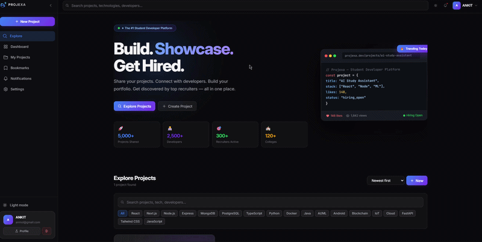
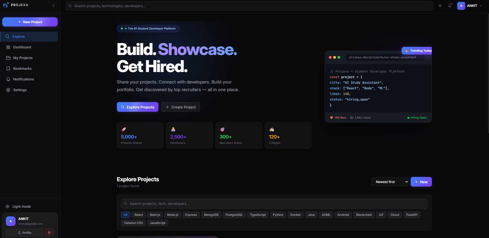
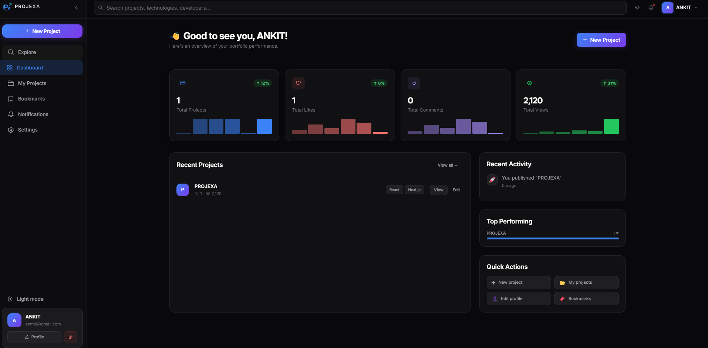
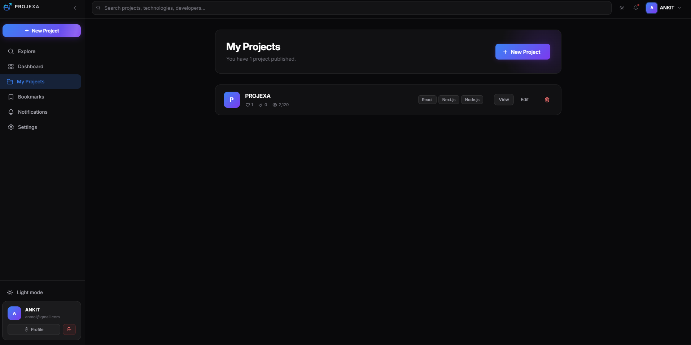
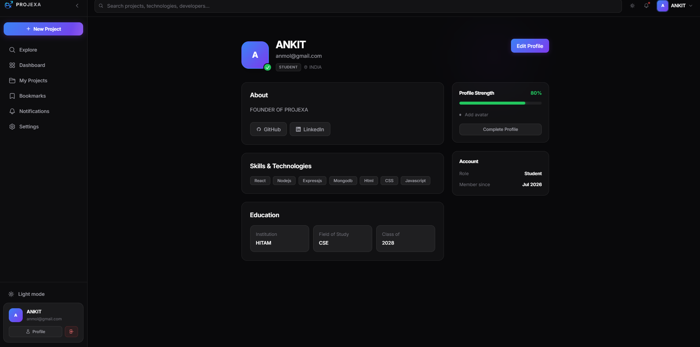
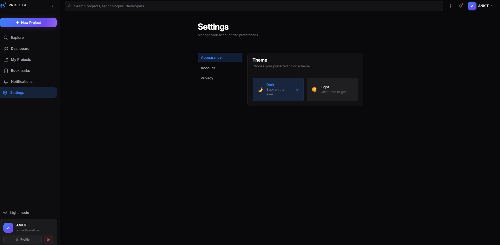

<div align="center">

# 🚀 PROJEXA

### Build. Showcase. Get Hired.

A modern full-stack developer platform where students can showcase projects, build their portfolio, connect with developers, and get discovered by recruiters.


<p>


</p>

---

### 🌐 Live Demo

https://projexa-frontend.onrender.com

---

⭐ If you like this project, please consider giving it a star!

</div>

---

# 📖 About

Projexa is a modern developer portfolio platform inspired by GitHub, Dribbble, and Behance, designed specifically for students and aspiring developers.

It allows users to:

- 🚀 Showcase projects
- 👨‍💻 Build a professional portfolio
- 🔍 Discover other developers
- ❤️ Like projects
- 👀 Track project views
- 📂 Organize personal projects
- 🌐 Share GitHub & LinkedIn profiles
- 🎯 Get noticed by recruiters

---

# ✨ Features

## 🔐 Authentication

- JWT Authentication
- Secure Login & Signup
- Protected Routes
- Persistent User Sessions

---

## 📂 Project Management

- Create Projects
- Edit Projects
- Delete Projects
- Technology Tags
- GitHub Repository Links
- Live Demo Links
- Project Descriptions
- Project Views
- Likes

---

## 👤 User Profile

- Developer Bio
- Skills
- Education
- GitHub Profile
- LinkedIn Profile
- Profile Completion
- Avatar Support

---

## 📊 Dashboard

- Total Projects
- Total Likes
- Total Views
- Total Comments
- Recent Activity
- Quick Actions

---

## 🔎 Discover Projects

- Search Projects
- Technology Filters
- Responsive Cards
- Trending Projects
- Beautiful Dark UI

---

## 🎥 Demo



# 📸 Screenshots

## 🏠 Home Page



---

## 📊 Dashboard



---

## 📂 My Projects



---

## 👤 Profile



---

## ⚙️ Settings



---

# 🛠 Tech Stack

## Frontend

- React.js
- Vite
- Tailwind CSS
- React Router DOM
- Axios
- React Icons
- Framer Motion

---

## Backend

- Node.js
- Express.js

---

## Database

- MongoDB
- Mongoose

---

## Authentication

- JWT
- bcrypt.js

---

## Cloud Storage

- Cloudinary

---

# 📁 Folder Structure

```
Projexa
│
├── assets/
├── client/
│   ├── src/
│   ├── components/
│   ├── pages/
│   ├── hooks/
│   ├── context/
│   └── services/
│
├── server/
│   ├── controllers/
│   ├── middleware/
│   ├── models/
│   ├── routes/
│   ├── config/
│   └── utils/
│
├── README.md
└── package.json
```

---

# ⚙️ Installation

Clone the repository

```bash
git clone https://github.com/ankitanmol26/projexa.git
```

Go inside the project

```bash
cd projexa
```

Install dependencies

Frontend

```bash
cd client
npm install
```

Backend

```bash
cd ../server
npm install
```

---

# 🔑 Environment Variables

Backend

```env
PORT=

MONGO_URI=

JWT_SECRET=

CLOUDINARY_CLOUD_NAME=

CLOUDINARY_API_KEY=

CLOUDINARY_API_SECRET=
```

Frontend

```env
VITE_API_URL=
```

---

# ▶️ Run the Project

Backend

```bash
npm run dev
```

Frontend

```bash
npm run dev
```

---

# 🎯 Current Features

- ✅ Authentication
- ✅ Project Showcase
- ✅ Dashboard
- ✅ Profile Page
- ✅ Settings
- ✅ Responsive Design
- ✅ Dark Mode
- ✅ Cloudinary Uploads
- ✅ Search
- ✅ Tech Filters
- ✅ Professional UI

---

# 🚀 Future Roadmap

- AI Project Recommendations
- AI Resume Review
- AI Portfolio Review
- Recruiter Dashboard
- Messaging System
- Notifications
- Project Comments
- Team Collaboration
- Bookmark Collections
- Follow Developers
- Internship Portal
- Hackathon Hub
- GitHub Contribution Graph
- Resume Builder
- Portfolio Analytics
- Leaderboard

---

# 📈 Performance Goals

- Responsive on all devices
- Clean component architecture
- Secure authentication
- Optimized API requests
- Reusable UI components
- Smooth animations
- Fast page loading

---

# 🤝 Contributing

Contributions are welcome!

1. Fork the repository

2. Create a new branch

```bash
git checkout -b feature-name
```

3. Commit your changes

```bash
git commit -m "Added new feature"
```

4. Push your branch

```bash
git push origin feature-name
```

5. Open a Pull Request

---

# 👨‍💻 Developer

## Ankit Kumar Singh

Full Stack Developer

- 💼 LinkedIn: [YOUR_LINKEDIN_PROFILE](https://www.linkedin.com/in/ankit-kumar-singh-026b16326/)
- 🐙 GitHub: https://github.com/ankitanmol26

---

# ⭐ Support

If you found this project helpful,

please consider giving it a ⭐ on GitHub.

It motivates me to build more open-source projects.

---

<div align="center">

## 🚀 Build. Showcase. Get Hired.

**Made with ❤️ using React, Node.js, Express, MongoDB and Tailwind CSS**

</div>
